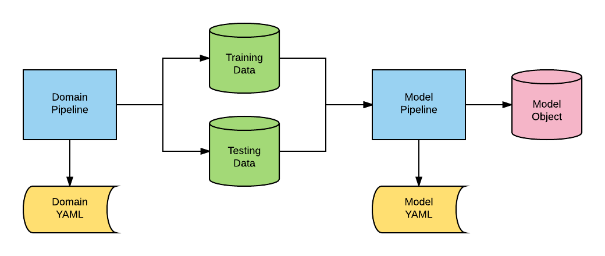

Introduction
============

**AlphaPy Pro** is a machine learning framework for configuration-driven model
development. Built on top of ``scikit-learn``, ``pandas``, and modern ML
libraries, it provides a reusable toolkit for feature engineering, model
training, evaluation, and prediction. Here are some of the things you can do
with AlphaPy Pro:

* Build and optimize ML models using ``scikit-learn``, ``XGBoost``, ``LightGBM``, and ``CatBoost``.
* Configure experiments with YAML instead of writing one-off training scripts.
* Create custom domain-specific pipelines around a shared model pipeline.
* Run classification, regression, ranking, and time-series style workflows.

The ``alphapy`` package provides the reusable model pipeline. Domain-specific
applications prepare canonical training and testing data outside the package,
then hand that data to AlphaPy for feature engineering, model training, and
evaluation. In ``v4.0.0``, the finance-specific MarketFlow stack was moved to
``alphapy-finance`` so ``alphapy-pro`` can stay focused on the ML core.

Let's review all of the components in the diagram:

``Domain Pipeline``:
    This is the Python code that creates the standard training and
    testing data. For example, you may be combining different data
    frames or collecting time series data from an external feed.
    These data are transformed for input into the model pipeline.

``Domain YAML``: 
    AlphaPy uses configuration files written in YAML to give the
    data scientist maximum flexibility. Typically, you will have
    a standard YAML template for each domain or application.

``Training Data``: 
    The training data is an external file that is read as a
    pandas dataframe. For classification, one of the columns will
    represent the target or dependent variable.

``Testing Data``:  
    The testing data is an external file that is read as a pandas
    dataframe. For classification, the labels may or may not be
    included.

``Model Pipeline``: 
    This Python code is generic for running all classification or
    regression models. The pipeline begins with data and ends with
    a model object for new predictions.

``Model YAML``: 
    The configuration file has specific sections for running the
    model pipeline. Every aspect of creating a model is controlled
    through this file.

``Model Object``: 
    All models are saved to disk. You can load and run your trained
    model on new data in scoring mode.

Core Functionality
------------------

**AlphaPy** has been developed primarily for supervised learning
tasks. You can generate models for any classification or regression
problem.

* Binary Classification: classify elements into one of two groups
* Multiclass Classification: classify elements into multiple categories
* Regression: predict real values based on derived coefficients

Classification Algorithms:

* CatBoost (CATB)
* LightGBM (LGB)
* XGBoost (XGB) Binary and Multiclass
* Random Forests (RF)
* Extra Trees (EXT)
* Gradient Boosting (GB)
* Logistic Regression (LOGR)
* K-Nearest Neighbors (KNN)
* Support Vector Machine (SVM)
* Naive Bayes (NB)
* AdaBoost (ADA)

Regression Algorithms:

* CatBoost Regressor
* LightGBM Regressor
* XGBoost Regressor
* Random Forest Regressor
* Extra Trees Regressor
* Gradient Boosting Regressor
* Linear Regression
* Ridge Regression
* Lasso Regression
* K-Nearest Neighbors Regressor

Key Features
------------

**AlphaPy Pro** includes several advanced features for modern ML workflows:

* **Feature Engineering**: Automated feature generation with clustering, interactions, and transformations
* **Feature Selection**: LOFO (Leave One Feature Out) importance and univariate selection
* **Model Calibration**: Probability calibration with sigmoid and isotonic methods
* **Advanced Visualization**: Learning curves, ROC curves, confusion matrices, and feature importance plots
* **Grid Search**: Randomized and systematic hyperparameter optimization
* **Ensemble Methods**: Model blending and stacking

External Packages
-----------------

**AlphaPy Pro** leverages cutting-edge ML and data science packages:

* **Gradient Boosting**: XGBoost, LightGBM, CatBoost
* **Feature Engineering**: category_encoders, lofo-importance
* **Imbalanced Learning**: imbalanced-learn (SMOTE, ADASYN, etc.)
* **Calibration**: venn-abers for probability calibration
* **Visualization**: matplotlib, seaborn, plotly
* **Time Series**: statsmodels, arch
